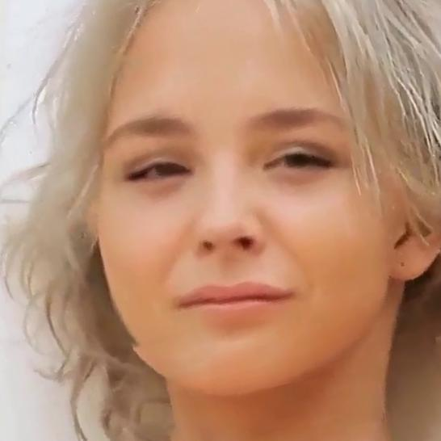
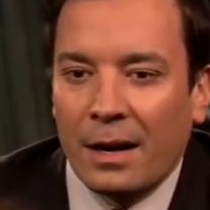

# <!-- omit in toc --> MesoNet - A Deepfake Detector Built Using Python and Deep Learning

The problem of misinformation has concerned me for a long time. Having witnessed the drastic effects of it in both my country and elsewhere, I think my concerns are rightly placed.

Here, I make my small attempt in doing something about it.

## <!-- omit in toc --> Table of Contents

- [1. Introduction](#1-introduction)
- [2. General Approach](#2-general-approach)
  - [2.1. The Code](#21-the-code)
  - [2.2. The Model](#22-the-model)
  - [2.3. The Data](#23-the-data)
- [3. References](#3-references)

## 1. Introduction

This project is part of the requirements to finish my Bachelor's degree in Computer Science (2017-2021).

It aims to demonstrate a solution to a small part of the misinformation problem. In particular, I detail here my approach in implementing a CNN-based DeepFake detector, first detailed in a paper published by Darius Afchar ([Github](https://github.com/DariusAf)) et al. in 2018 [[1]](#ref-1), called **MesoNet**. The official implementation (without any training code) is available [here](https://github.com/DariusAf/MesoNet).

The overall project consists of three parts:

- [Part 1: Model Construction and Training](https://github.com/MalayAgarwal-Lee/MesoNet-DeepFakeDetection) - This builds and trains various MesoNet variants, with the objective of obtaining multiple well-performing variants in the end. It is implemented using [TensorFlow](https://github.com/tensorflow/tensorflow).
- [Part 2: API](https://github.com/MalayAgarwal-Lee/MesoNet-DeepfakeDetection-API) - This is an API that can be used to fetch results from a trained MesoNet model. It is implemented using [Django](https://github.com/django/django) and the [Django Rest Framework](https://github.com/encode/django-rest-framework).
- [Part 3: Frontend](https://github.com/MalayAgarwal-Lee/MesoNet-DeepfakeDetection-WebApp) - This is a webapp app which uses the above API to allow any Internet user to explore the inner workings of MesoNet. It is implemented in [Node.js](https://github.com/nodejs/node).

**You're currently reading about Part 1**.

## 2. General Approach

### 2.1. The Code

The main focus in constructing and training the model was to make it modular and portable. A secondary focus was also to make it easier you to use MesoNet without tinkering with the code. With these objectives in mind, the code has been broken up into two packages:

- [`mesonet`](./mesonet/) - This is the main package containing modules which construct and build MesoNet variants. While not currently set up as a PyPI package, you can copy the directory to their project and obtain the necessary functionality to build, train and obtain predictions from MesoNet.
- [`cli`](./cli/) - This package provides a command line interface (CLI) that can be used to both train and obtain predictions from MesoNet. This allows you to use MesoNet without tinkering with the code. Currently, it only supports training the architecture as detailed in the paper. Additionally, the `mesonet.py` file provides an entrypoint to the CLI.

### 2.2. The Model

The model, as mentioned above, is based on a paper published by Darius Afchar et al. in 2018 [[1]](#ref-1). It is a binary classifier built as a relatively shallow Convolutional Neural Network (CNN), trained to classify images into one of two classes. One class refers to "real" images (images of real people) and the other refers to "fake" images (images generated by DeepFake AI).

> **Note**: The actual names of the classes is arbitrary and can be set according to the your wishes.

By default, the CLI works with the architecture detailed in the paper, which is as follows:

- `3 X 256 X 256` input layer, with the input being scaled by 255 and augmentations applied on it.
- Convolutional layer with `8` filters, `3 x 3` in size and stride of `1`, followed by a max pooling layer of size `2 x 2`.
- Convolutional layer with `8` filters, `5 x 5` in size and stride of `1`, followed by a max pooling layer of size `2 x 2`.
- Two convolutional layers with `16` filters, `5 x 5` in size and stride of `1`, followed by max pooling layers with pooling window of `2 x 2`.
- Fully-connected layer with `16` units.
- Fully-connected output layer with `1` unit and `sigmoid` activation.

<div align="center" style="padding: 10px;">
    
    <div>
        <em>Source: <a href="#ref-1">[1]</a></em>
    </div>
</div>

This leads to a modest 27,977 trainable parameters for the model.

While this architecture is closely followed, experiments with various activation functions have been carried out and the code is designed such that it is extremely convenient to switch the activation function for the entire model. Specifically, in addition to using the standard ReLU activation, experiments with ELU [[2]](#ref-2) and LeakyReLU [[3]](#ref-3) have also been carried out.

ReLU is the activation function of choice since there is no apparent risk of dead neurons. Additionally, there exists a LeakyReLU activation after the fully-connected 16-unit layer. There is no apparent reason behind this other than this is what the paper uses.

Additionally, some modern-day conventional practices have been added to the model. Specifically, the following two practices have been adopted:

- Bath Normalization - Batch Normalization is added after each convolutional layer to improve convergence speed and to combat overfitting.
- Dropout [[4]](#ref-4) - Dropout is added after the fully-connected 16-unit layer to combat overfitting.

### 2.3. The Data

A dataset collected by the authors of the paper is used to train the models provided in this repo, called the **DeepFake dataset**. You can download it from [here](https://my.pcloud.com/publink/show?code=XZLGvd7ZI9LjgIy7iOLzXBG5RNJzGFQzhTRy).

It contains a training set and a test set. The overall directory structure is as follows:

```bash
└── data/
    ├── train/
    │   ├── real/
    │   │   ├── img1.png
    │   │   └── img2.png
    │   └── forged/
    │       ├── img1.png
    │       └── img2.png
    └── test/
        ├── real/
        │   ├── img1.png
        │   └── img2.png
        └── forged/
            ├── img1.png
            └── img2.png
```

> **Note**: The paper refers to the validation set as the test set, mainly because of when it was written.

> **Note**: The name of the classes can be changed by renaming the `real` and `forged` directories.

The images of faces have been extracted from publicly-available videos on the Internet. According to the paper, for the fake images, 175 videos have been downloaded from different online platforms. Their duration is between 2 seconds and 3 minutes, with a minimum resolution of _854 x 450 px_. They have been compressed using the H.264 codec but using different compression levels. More details on dataset collection are available in the paper.

The distribution of images is as follows ([source](https://github.com/DariusAf/MesoNet/blob/master/README.md#aligned-face-datasets)):

| Set      | Size of the forged image class | Size of real image class | Total |
| -------- | ------------------------------ | ------------------------ | ----- |
| Training | 5111                           | 7250                     | 12361 |
| Test     | 2889                           | 4259                     | 7148  |
|          | 8000                           | 11509                    | 19509 |

> **Note**: It may be that TensorFlow doesn't detect all 19,509 images. In my case, it detected 19,457 images. The below numbers are with respect to that.

In reality, thought, it may be the case that the you may NOT achieve the claimed accuracy in the paper. This could be because of the size of the dataset, which has potentially too many images in the test set.

To combat this, the size can be increased using this [script](./bloat_data.py). It takes all the images and creates a new dataset by holding back only 10% of the data (randomly) for the test set (instead of the ~36.7% in the original dataset). This changes the distribution to:

| Set      | Size of the forged image class | Size of real image class | Total |
| -------- | ------------------------------ | ------------------------ | ----- |
| Training | 7175                           | 10337                    | 17512 |
| Test     | 773                            | 1172                     | 1945  |
|          | 7948                           | 11509                    | 19457 |

The dataset used to train the pre-trained models is available [here](https://drive.google.com/drive/folders/15E6NZr9vhsOfX_nkOtiYkIpWZwtpNi_7?usp=sharing).

Alternatively, you can use any dataset of your choice as long as the directory structure matches the one above.

Sample images are shown below:

|       | Forged                                                                | Real                                                                |
| ----- | --------------------------------------------------------------------- | ------------------------------------------------------------------- |
| Train |  |  |
| Test  |   |   |

## 3. References

- <a  id="ref-1">[1]</a> Afchar, Darius, et al. [Mesonet: a compact facial video forgery detection network](https://arxiv.org/abs/1809.00888).
- <a  id="ref-2">[2]</a> Djork-Arné Clevert, Thomas Unterthiner, & Sepp Hochreiter. (2015). [Fast and Accurate Deep Network Learning by Exponential Linear Units (ELUs)](https://arxiv.org/abs/1511.07289).
- <a  id="ref-3">[3]</a> Andrew L. Maas. (2013). [Rectifier Nonlinearities Improve Neural Network Acoustic Models](https://ai.stanford.edu/~amaas/papers/relu_hybrid_icml2013_final.pdf).
- <a  id="ref-4">[4]</a> Nitish Srivastava, Geoffrey Hinton, Alex Krizhevsky, Ilya Sutskever, & Ruslan Salakhutdinov (2014). [Dropout: A Simple Way to Prevent Neural Networks from Overfitting](http://jmlr.org/papers/v15/srivastava14a.html). Journal of Machine Learning Research, 15(56), 1929-1958.
