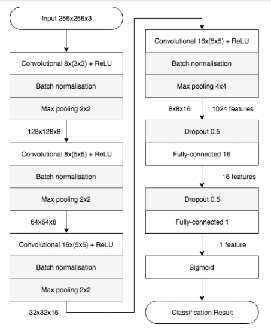

# <!-- omit in toc --> MesoNet - A Deepfake Detector Built Using Python and Deep Learning

The problem of misinformation has concerned me for a long time. Having witnessed the drastic effects of it in both my country and elsewhere, I think my concerns are rightly placed.

Here, I make my small attempt in doing something about it.

## <!-- omit in toc --> Table of Contents

- [1. Introduction](#1-introduction)
- [2. General Approach](#2-general-approach)
  - [2.1. The Code](#21-the-code)
  - [2.2. The Model](#22-the-model)
- [3. References](#3-references)

## 1. Introduction

This project is part of the requirements to finish my Bachelor's degree in Computer Science (2017-2021).

It aims to demonstrate a solution to a small part of the misinformation problem. In particular, I detail here my approach in implementing a CNN-based DeepFake detector, first detailed in a paper published by Darius Afchar ([Github](https://github.com/DariusAf)) et al. in 2018 [[1]](#ref-1), called **MesoNet**.

The overall project consists of three parts:

- [Part 1: Model Construction and Training](https://github.com/MalayAgarwal-Lee/MesoNet-DeepFakeDetection) - This builds and trains various MesoNet variants, with the objective of obtaining multiple well-performing variants in the end. It is implemented using [TensorFlow](https://github.com/tensorflow/tensorflow).
- [Part 2: API](https://github.com/MalayAgarwal-Lee/MesoNet-DeepfakeDetection-API) - This is an API that can be used to fetch results from a trained MesoNet model. It is implemented using [Django](https://github.com/django/django) and the [Django Rest Framework](https://github.com/encode/django-rest-framework).
- [Part 3: Frontend](https://github.com/MalayAgarwal-Lee/MesoNet-DeepfakeDetection-WebApp) - This is a webapp app which uses the above API to allow any Internet user to explore the inner workings of MesoNet. It is implemented in [Node.js](https://github.com/nodejs/node).

**You're currently reading about Part 1**.

## 2. General Approach

### 2.1. The Code

The main focus in constructing and training the model was to make it modular and portable. A secondary focus was also to make it easier for people to use MesoNet without tinkering with the code. With these objectives in mind, the code has been broken up into two packages:

- [`mesonet`](./mesonet/) - This is the main package containing modules which construct and build MesoNet variants. While not currently set up as a PyPI package, any user can copy the directory to their project and obtain the necessary functionality to build, train and obtain predictions from MesoNet.
- [`cli`](./cli/) - This package provides a command line interface (CLI) that can be used to both train and obtain predictions from MesoNet. This allows users to use MesoNet without tinkering with the code. Currently, it only supports training the architecture as detailed in the paper. Additionally, the `mesonet.py` file provides an entrypoint to the CLI.

### 2.2. The Model

The model, as mentioned above, is based on a paper published by Darius Afchar et al. in 2018 [[1]](#ref-1). It is a relatively shallow Convolutional Neural Network (CNN) model binary classifier, trained to classify images into one of two classes. One class refers to "real" images and the other refers to "fake" images.

> **Note**: The actual names of the classes is arbitrary and can be set according to the user's wishes.

By default, the CLI works with the architecture detailed in the paper, which is as follows:

- `3 X 256 X 256` input layer, with the input being scaled by 255 and augmentations applied on it.
- Two convolutional layers with `8` filters, `3 x 3` in size and stride of `1`, followed by max pooling layers with pooling window of `2 x 2`.
- Two convolutional layers with `16` filters, `5 x 5` in size and stride of `1`, followed by max pooling layers with pooling window of `2 x 2`.
- Fully-connected layer with `16` units.
- Fully-connected output layer with `1` unit and `sigmoid` activation.

    
    

        <em>Source: <a href="#ref-1">[1]</a></em>
    

This leads to a modest 27,977 trainable parameters for the model.

While this architecture is closely followed, experiments with various activation functions have been carried out and the code is designed such that it is extremely convenient to switch the activation function for the entire model. Specifically, in addition to using the standard ReLU activation, experiments with ELU [[2]](#ref-2) and LeakyReLU [[3]](#ref-3) have also been carried out.

ReLU is the activation function of choice since there aren't any negative values in the training data, leading to potentially no dead neurons. Additionally, there exists a LeakyReLU activation after the fully-connected 16-unit layer. There is no apparent reason behind this other than this is what the paper uses.

In addition to this,some modern-day conventional practices have been added to the model. Specifically, the following two practices have been adopted:

- Bath Normalization - Batch Normalization is added after each convolutional layer to improve convergence speed and to combat overfitting.
- Dropout [[4]](#ref-4) - Dropout is added after the fully-connected 16-unit layer to combat overfitting.

## 3. References

- <a  id="ref-1">[1]</a> Afchar, Darius, et al. [Mesonet: a compact facial video forgery detection network](https://arxiv.org/abs/1809.00888).
- <a  id="ref-2">[2]</a> Djork-Arné Clevert, Thomas Unterthiner, & Sepp Hochreiter. (2015). [Fast and Accurate Deep Network Learning by Exponential Linear Units (ELUs)](https://arxiv.org/abs/1511.07289).
- <a  id="ref-3">[3]</a> Andrew L. Maas. (2013). [Rectifier Nonlinearities Improve Neural Network Acoustic Models](https://ai.stanford.edu/~amaas/papers/relu_hybrid_icml2013_final.pdf).
- <a  id="ref-4">[4]</a> Nitish Srivastava, Geoffrey Hinton, Alex Krizhevsky, Ilya Sutskever, & Ruslan Salakhutdinov (2014). [Dropout: A Simple Way to Prevent Neural Networks from Overfitting](http://jmlr.org/papers/v15/srivastava14a.html). Journal of Machine Learning Research, 15(56), 1929-1958.
